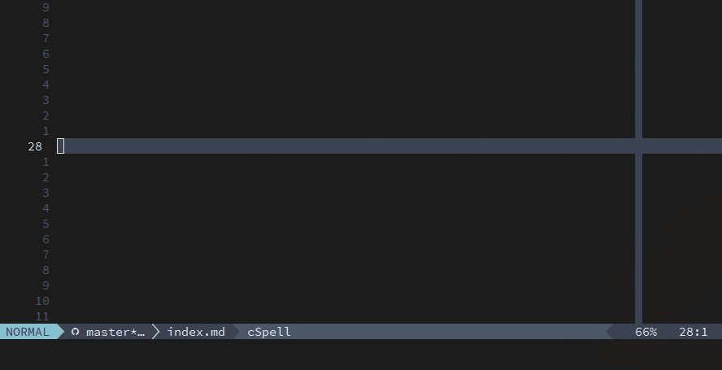

# Dynamic tabstop generation


UltiSnips at the present day is more than snippet engine. It's more like
constructor, where you can implement some complex features without prior
feature implementation in the snippet by itself.

One of that features is dynamic tabstop generation.

Consider case, where you want set of snippets for inserting latex rows of
various lengths. No-brainer solution is just implement snippet for every
row length you're possible will want, like this:

```
snippet tr9 "LaTeX table row of length nine"
$1 & $2 & $3 & $4 & $5 & $6 & $7 & $8 & $9
endsnippet
```

But soon it becomes a burden to maintain that kind of snippets.

Gladly, tabstops can be generated by using anonymous snippet expansion:

```
global !p
def create_row_placeholders(snip):
    # retrieving single line from current string and treat it like tabstops
    # count
    placeholders_amount = int(snip.buffer[snip.line].strip())

    # erase current line
    snip.buffer[snip.line] = ''

    # create anonymous snippet with expected content and number of tabstops
    anon_snippet_body = ' & '.join(['$' + str(i+1)
                                    for i in range(placeholders_amount)])

    # expand anonymous snippet
    snip.expand_anon(anon_snippet_body)
endglobal

post_jump "create_row_placeholders(snip)"
snippet "tr(\d+)" "latex table row variable" br
`!p snip.rv = match.group(1)`
endsnippet
```

Snippet is declared via regular expression and will expand to any required
number of fields in row.

Now, for a more robust tabstop generation, to create placeholders within
multiple lines:

```
global !p
def create_matrix_placeholders(snip):
	# Create anonymous snippet body
	anon_snippet_body = ""

	# Get start and end line number of expanded snippet
	start = snip.snippet_start[0]
	end = snip.snippet_end[0]

  # Append current line into anonymous snippet
	for i in range(start, end + 1):
		anon_snippet_body += snip.buffer[i]
		anon_snippet_body += "" if i == end else "\n"

	# Delete expanded snippet line till second to last line
	for i in range(start, end):
		del snip.buffer[start]

	# Empty last expanded snippet line while preserving the line
	snip.buffer[start] = ''

	# Expand anonymous snippet
	snip.expand_anon(anon_snippet_body)

def create_matrix(cols, rows, sep, start, end):
	res = ""
	placeholder = 1
	for _ in range(0, int(rows)):
		res += start + f"${placeholder} "
		placeholder += 1
		for _ in range(0, int(cols) - 1):
			res += sep + f" ${placeholder} "
			placeholder += 1
		res += end
	return res[:-1]
endglobal

post_jump "create_matrix_placeholders(snip)"
snippet 'arr(\d+),(\d+)' "LaTeX array" br
\begin{array}{`!p
orient = ""
for _ in range(0, int(match.group(1))): orient += "l"
snip.rv = orient`}
`!p
snip.rv = create_matrix(match.group(1), match.group(2), "&", "\t", "\\\\\\\\\n")
`$0
\end{array}
endsnippet
```


